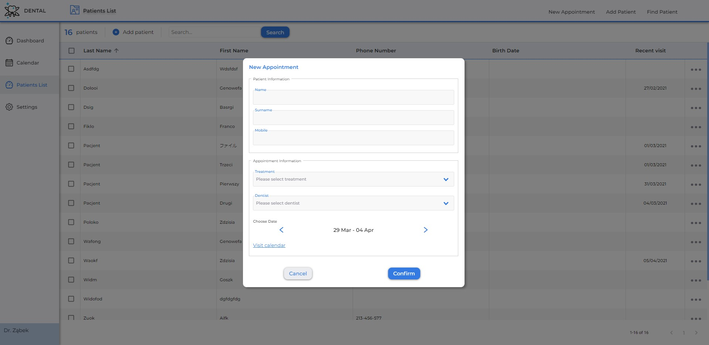

# Dental Clinic

This project is still in development.

Design and development made by me. 

## Features
- Manage patients
  - Create new 
  - Look for existing
  - Write charts 
- Appointments scheduler
  - Create appointments for given dentist
  - Visualize appointment status
- Customization
  - Personalize patient charting

## Build with

- [React](https://reactjs.org/)
- [Apollo](https://www.apollographql.com/)
- [TypeGraphQL](https://typegraphql.com/)
- [TypeScript](https://www.typescriptlang.org/)
- [Prisma](https://www.prisma.io/)
- [Postgres]

## Run instructions

This project is separated into client and server. You have to install dependecies for both directories with

`npm install`

You also have to create a Postgres database.

If you also want to have access to Apollo Studio follow [this instructions](https://www.apollographql.com/docs/studio/getting-started/)